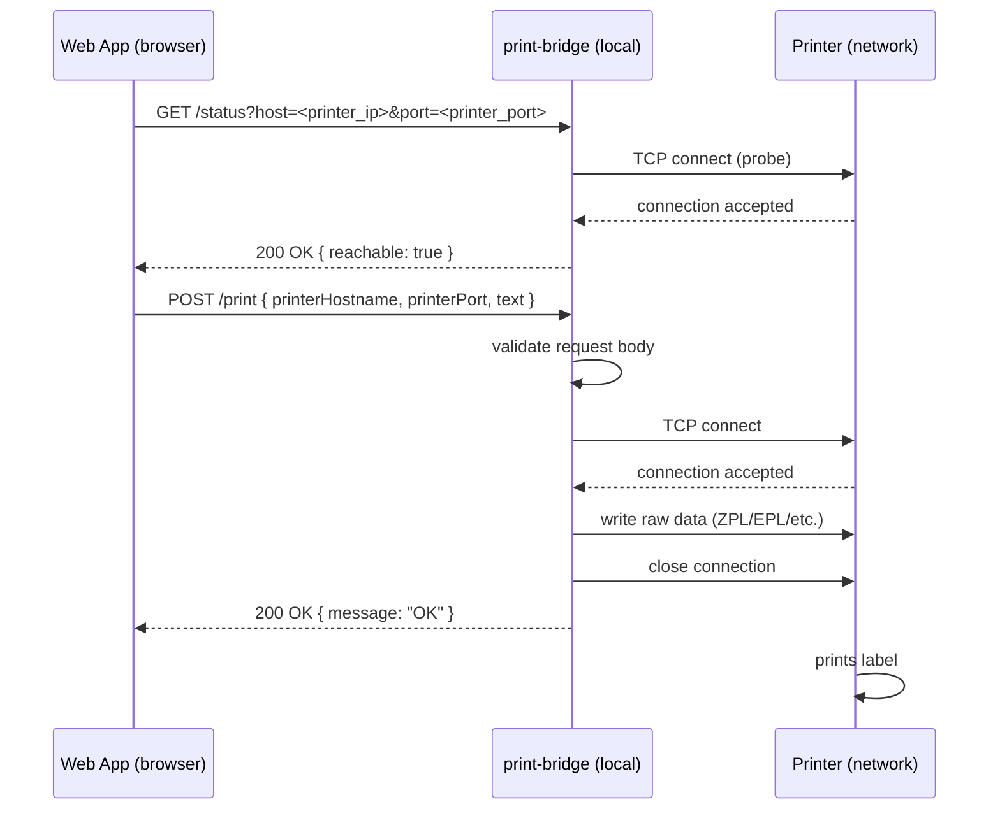
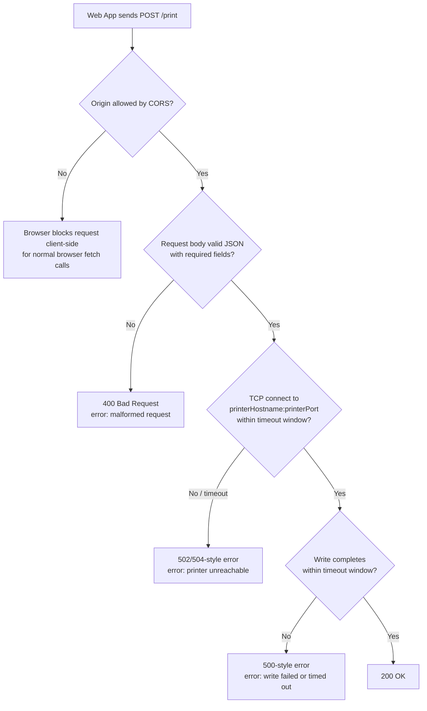

# Process — Print Job Flow

Read `04-api/openapi.yaml` alongside this document for exact request/response shapes; this file describes the *flow*, the spec is authoritative for the *contract*.

## Actors

- **Web App** — any browser-based application, running on an origin present in print-bridge's CORS allow-list.
- **print-bridge** — the local app, listening on `http://localhost:<http_port>`.
- **Printer** — a network device accepting raw data on a TCP port (typically 9100).

## Happy path

The `/status` pre-flight call is optional but recommended for integrators who want to show the end user a live "printer ready" indicator before attempting a print.

## Failure paths

## Notes for implementation

- The **CORS check happens in the browser**, not something print-bridge can control beyond setting the correct response headers. For normal browser `fetch()` calls, the web app sees a browser-level CORS error rather than a print-bridge error response if the origin is not allow-listed. CORS does not block same-machine non-browser clients.
- Both the connect step and the write step must be bounded by a timeout (see `03-architecture/architecture-overview.md` for the specific value) so BR-6 (predictable failure behavior) holds even when a printer is powered on but unresponsive, not just when it's fully offline.
- Every request (success or failure) should be written to the local rotating log, including the target host/port, so a user can self-diagnose repeated failures without contacting support.
