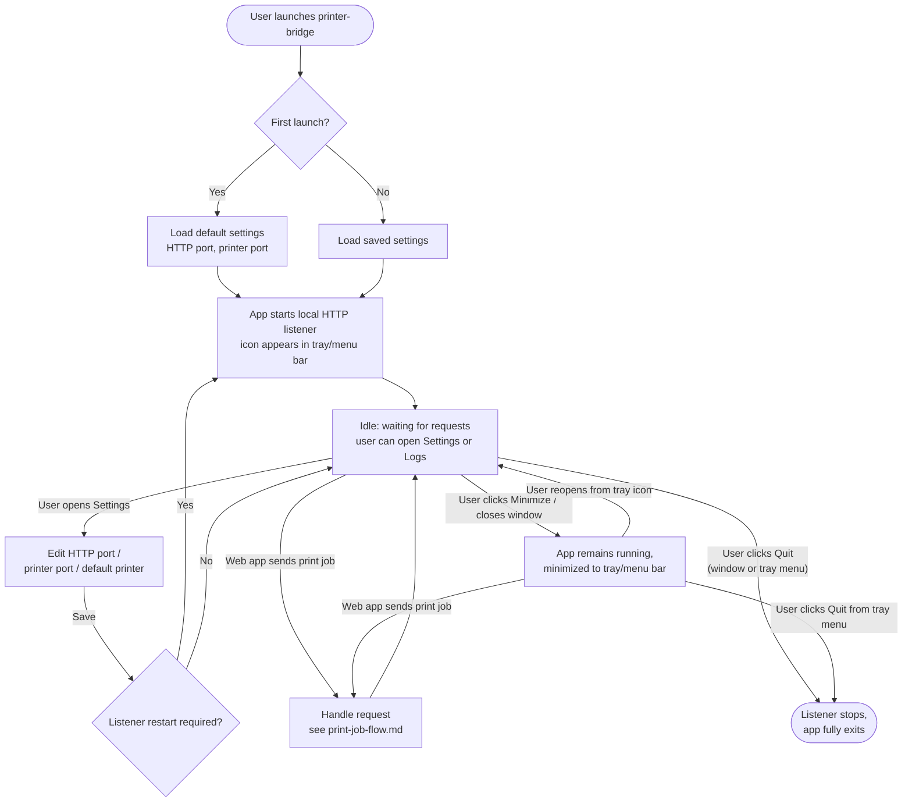

# Process — User Workflow

This describes the end user's lifecycle with the printer-bridge application itself, independent of any single print job. See `05-ux/tray-app-spec.md` for exact UI states and screens.

## App lifecycle

## Key behaviors to preserve

- **Minimizing keeps the listener alive.** A web app can still print while the window is minimized to the tray — this is the whole point of running it as a tray-capable app rather than a plain window.
- **Quitting is a deliberate, explicit action.** There is no auto-start and no "close = quit" ambiguity: closing the window minimizes; only Quit (from the window or the tray menu) actually stops the listener and exits the process. This must be visually unambiguous in the UI — see `05-ux/tray-app-spec.md`.
- **Settings changes that affect the listener (HTTP port, printer default) require a listener restart** to take effect; this should be handled by the app automatically rather than requiring the user to quit and relaunch.
- **No persistence beyond settings.** The app does not need to remember print job history across restarts in the current beta — only the current session's log file, per `03-architecture/architecture-overview.md`.
