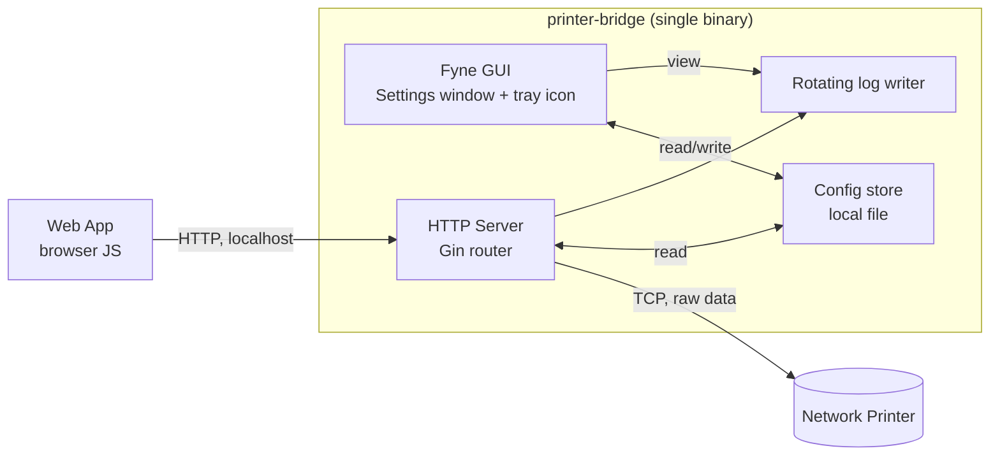

# Architecture Overview — printer-bridge

Read `01-business/constraints.md` and `03-architecture/decisions.md` alongside this document. This file describes *what* to build; `decisions.md` records *why* specific alternatives were rejected.

## Components

## Tech stack

| Layer | Choice | Rationale |
|---|---|---|
| Language | Go | Existing backend prototype is already Go; single language for the whole app keeps this maintainable by one person. |
| HTTP server | Gin (already in use) | Proven in the existing prototype; no reason to replace working code. |
| GUI / tray | Fyne | Native cross-platform Go GUI with built-in system tray support; single compiled binary, no embedded browser/webview dependency. See conversation rationale — chosen over Wails to avoid a WebView2 runtime dependency on Windows and because Fyne's tray support is more mature. |
| Config storage | Local file (see `06-config/config-schema.md`) | No external database; matches "few moving parts" constraint. |
| Logging | Rotating local file (e.g. `lumberjack`-style rotation) | Self-service diagnosis for users without a support team (BR-8). |
| Distribution | GitHub Releases + Actions (existing) | No paid infrastructure; matches budget constraints. |

## Runtime model

printer-bridge runs as a **single process** containing both the GUI (Fyne) and the HTTP server (Gin), on one goroutine tree:

- The HTTP server runs in its own goroutine, started when the app launches and stopped when the user quits.
- The GUI event loop runs on the main thread, per Fyne's requirements.
- Settings changes that affect the listener (HTTP port, default printer) trigger a clean stop/restart of the HTTP server goroutine, not a full app restart.

This is a deliberate simplification over running the HTTP agent as a separate background process from the GUI — one process is easier to reason about, easier to install/uninstall cleanly, and there's no auto-start requirement (see `decisions.md`) forcing a headless-service split.

## Key architectural values

- **Fail fast, not silently.** Every network operation (TCP connect, write) must have an explicit timeout. See timeout values below.
- **Few moving parts.** No database, no background service registration, no external dependencies beyond what's compiled into the binary.
- **Self-diagnosable.** Logs and a status endpoint exist so a user can figure out what went wrong without contacting the maintainer.

## Timeouts

| Operation | Timeout | Behavior on timeout |
|---|---|---|
| TCP connect to printer | 3 seconds | Return error: printer unreachable |
| TCP write to printer | 5 seconds | Return error: write failed/timed out |
| `/status` probe connect | 3 seconds | Return `{ reachable: false }`, not an error — this is an expected outcome for a status check |

These values are defaults; do not hardcode them so tightly that they can't be adjusted later, but they do not need to be user-configurable in v1 (see `06-config/config-schema.md` for what is/isn't user-facing).

## Logging

- Rotating log file, local to the app's data directory (platform-appropriate: `~/Library/Application Support/PrinterBridge/` on macOS, `%APPDATA%\PrinterBridge\` on Windows).
- Log every request: timestamp, endpoint, target host:port, outcome (success/error), and error detail if applicable.
- Rotation policy: cap individual log file size (e.g. 5MB) and retain a small number of rotated files (e.g. 3) — exact values are an implementation detail, not a business requirement, but must exist so logs don't grow unbounded on a machine left running for a long session.
- Viewable from within the app (see `05-ux/tray-app-spec.md`) — the user should not need to hunt through the filesystem to see recent activity.

## What this document does not cover

- Exact API request/response schemas — see `04-api/openapi.yaml`.
- UI screens/states — see `05-ux/tray-app-spec.md`.
- Config file format — see `06-config/config-schema.md`.
- Why certain alternatives (auto-start, token auth, paid signing) were rejected — see `03-architecture/decisions.md`.
