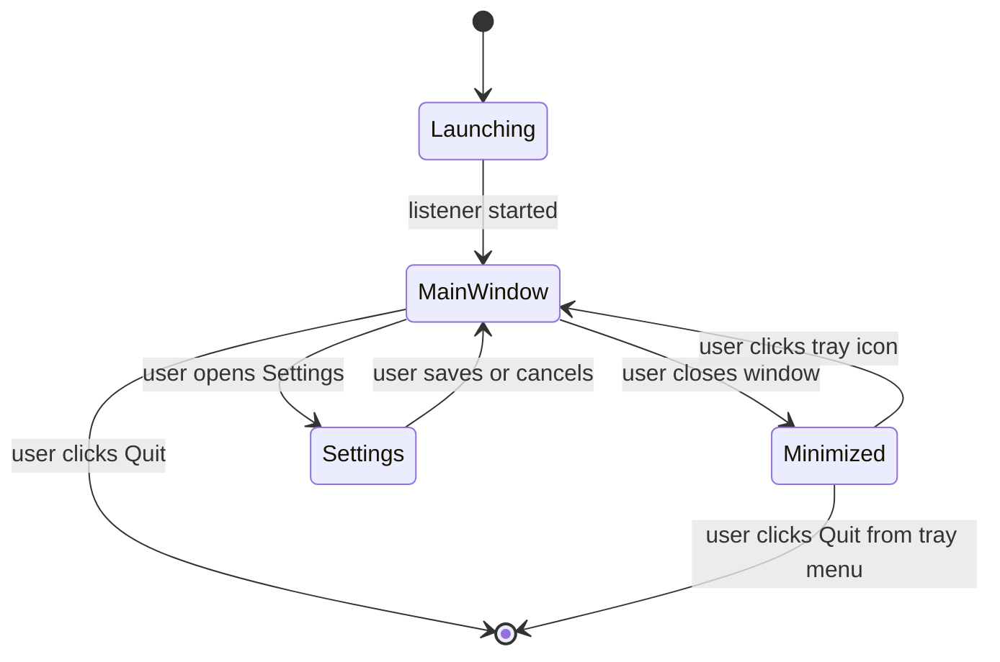

# UX Spec — Tray App

Read `02-process/bpmn-user-workflow.md` first for the lifecycle this UI implements. This document defines the specific screens, states, and controls.

## App states

## Screens

### 1. Main window

The default view when the app is open.

**Contents:**
- Status indicator: listener running (green) with the current HTTP port shown, e.g. "Listening on localhost:8080"
- Non-affiliation disclaimer, always visible, short form: "printer-bridge is an independent project, not affiliated with Zebra Technologies or any printer manufacturer." (full text in `09-legal/disclaimer.md`)
- Buttons/links: **Settings**, **View Logs**, **Quit**
- Recent activity: a short live-updating list of the last few requests (timestamp, endpoint, outcome) — a lightweight in-window view of the same data written to the log file. Not a full log viewer; see "View Logs" below for that.

**Close button behavior:** clicking the window's close control **minimizes to tray**, it does not quit. This must be visually signposted — e.g. a tooltip or one-time notice on first close ("printer-bridge is still running in the tray") so the user isn't confused about whether the app exited.

### 2. Settings

Opened from the main window. See `06-config/config-schema.md` for the exact fields and validation rules; this section covers the screen behavior only.

**Contents:**
- HTTP port (numeric input)
- Default printer port (numeric input, pre-filled with 9100)
- Default printer address (optional text input — a convenience default, not a saved profile list; see ADR scope note below)
- CORS allowed origins (list input — add/remove entries)
- **Save** and **Cancel** buttons

**Save behavior:**
- Validate inputs client-side (port ranges, non-empty required fields) before allowing Save.
- On Save, persist to the config file and trigger the HTTP listener restart described in `03-architecture/architecture-overview.md`.
- Show a brief confirmation (e.g. "Settings saved — listener restarted on port 8080") so the user has positive feedback that the restart happened.
- **Cancel** discards changes and returns to the main window without touching the running listener.

### 3. Logs viewer

Opened from the main window. Displays the current rotating log file's contents (see `03-architecture/architecture-overview.md` for rotation policy).

- Read-only text view, most recent entries first or a scroll-to-bottom default — pick one and keep it consistent; recommend most-recent-first since users opening this are typically troubleshooting a just-failed print.
- A "Reveal in Finder/Explorer" button (platform-appropriate) so a technical user or the maintainer, if asked for help, can grab the raw file.
- No in-app filtering/search required for v1 — this is a lightweight troubleshooting view, not a log management tool.

### 4. Tray/menu bar icon

Persistent while the app is running (whether the main window is open or minimized).

**Left-click / click:** opens or focuses the main window.

**Right-click menu (or platform-equivalent):**
- Open printer-bridge (same as click)
- Status: shows a non-interactive line, e.g. "Listening on port 8080" or "Stopped" if the listener failed to start
- Quit

## States to handle explicitly

| State | UI behavior |
|---|---|
| Listener fails to start (e.g. port already in use) | Main window shows a clear error with the specific reason and a shortcut to Settings to change the port. Tray icon still appears (so the user isn't left with no way to reach the app) but its status line reflects "Stopped." |
| Settings save triggers restart, restart fails | Show the same error pattern as above, inline in the Settings screen, without discarding the user's entered values (so they don't have to retype). |
| First launch | No special onboarding flow required for v1 — default settings are sensible enough (see `06-config/config-schema.md`) that the main window is usable immediately. |

## Explicitly out of scope for v1

- No saved multi-printer profile list — the "default printer address" field is a single convenience value, not an address book (see BRD out-of-scope, BR/ADR references).
- No in-app update checker/notification.
- No dark/light theme toggle — follow the OS theme automatically if Fyne provides this for free; do not build custom theming.
