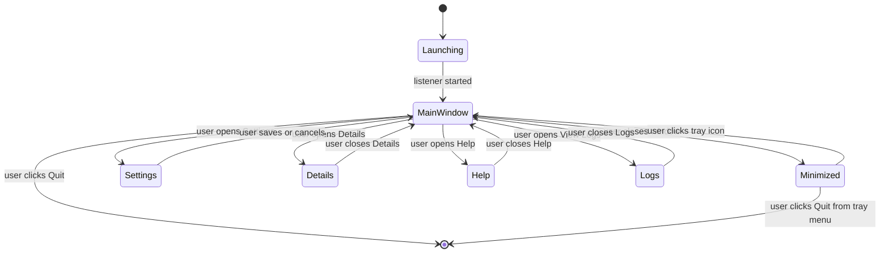

# UX Spec — Tray App

Read `02-process/bpmn-user-workflow.md` first for the lifecycle this UI implements. This document defines the specific screens, states, and controls.

## App states

## Screens

### 1. Main window

The default view when the app is open.

**Contents:**
- Compact window sized for status, configuration summary, and actions only.
- App logo, using the project icon asset.
- Status indicator: listener running (green) with the current HTTP listener shown, e.g. "Listening on 127.0.0.1:8080"
- Runtime details: default printer address/port and allowed origins. If no origins are configured, show a clear empty state and point the user to Settings. Do not repeat the listener address here; the status row already owns listener status.
- Non-affiliation disclaimer, always visible, short form: "printer-bridge is an independent project, not affiliated with or endorsed by any printer manufacturer." (full text in `09-legal/disclaimer.md`)
- Buttons/links: **Settings**, **Details**, **Help**, **View Logs**, **Quit**

**Close button behavior:** clicking the window's close control **minimizes to tray**, it does not quit. This must be visually signposted — e.g. a tooltip or one-time notice on first close ("printer-bridge is still running in the tray") so the user isn't confused about whether the app exited.

### 2. Settings

Opened from the main window. See `06-config/config-schema.md` for the exact fields and validation rules; this section covers the screen behavior only.

**Contents:**
- HTTP port (numeric input)
- Default printer port (numeric input, pre-filled with 9100)
- Default printer address (optional text input — a convenience default, not a saved profile list; see ADR scope note below)
- CORS allowed origins (list input — add/remove entries; empty by default)
- Tooltip-style helper text for every setting. The helper text should explain what the setting means in user-facing language without requiring documentation lookup.
- **Save** and **Cancel** buttons

**Save behavior:**
- Validate inputs client-side (port ranges, non-empty required fields) before allowing Save.
- On Save, persist to the config file and trigger the HTTP listener restart described in `03-architecture/architecture-overview.md`.
- Show a brief confirmation (e.g. "Settings saved — listener restarted on port 8080") so the user has positive feedback that the restart happened.
- **Cancel** discards changes and returns to the main window without touching the running listener.

### 3. Details

Opened from the main window. Displays all user-relevant runtime/configuration information in a read-only view with normal foreground contrast. This screen is the diagnostic/support bundle, so the content should be easy to read when troubleshooting an installation.

- App name and app ID.
- Listener running/stopped state, listener address, HTTP port, and last listener error.
- Default printer address and default printer port.
- Allowed CORS origins.
- Config file path and log file path.
- API endpoints.
- TCP timeout values and log rotation policy.

### 4. Help

Opened from the main window or tray/menu bar. Help is a first-class screen, separate from Details, focused on setup and troubleshooting instead of raw diagnostics. Its language is for a normal user, not a developer.

**Contents:**
- Current listener, default printer address/port, and allowed-origin summary.
- What to check when nothing prints.
- What to check when the website cannot connect.
- Printer IP address or hostname guidance.
- Printer port guidance.
- Allowed origin guidance using website-address language, including that an allowed origin is different from the printer IP address.
- Common failure checks: printer power/network, exact origin match, printer address/port, VPN, firewall, logs, and the Details screen.
- Support and feedback note with Jaime Bolaños, `https://jbolanos.dev`, and GitHub: `https://github.com/JamesBolanos`. Tone should be helpful and confident, not a sales pitch.

### 5. Logs viewer

Opened from the main window. Displays the current rotating log file's contents as a live activity view (see `03-architecture/architecture-overview.md` for rotation policy).

- Read-only normal-contrast text view, most recent entries first, with a clear label that states the order and that the view updates automatically.
- No in-window action buttons; updates happen automatically while the window is open.
- No in-app filtering/search required for the current beta — this is a lightweight troubleshooting view, not a log management tool.

### 6. Tray/menu bar icon

Persistent while the app is running (whether the main window is open or minimized).

**Left-click / click:** opens or focuses the main window.

**Right-click menu (or platform-equivalent):**
- Open printer-bridge (same as click)
- Details
- Help
- Status: shows a non-interactive line, e.g. "HTTP: 127.0.0.1:8080" or "Stopped" if the listener failed to start
- Default printer port
- Allowed origin count
- Quit

## States to handle explicitly

| State | UI behavior |
|---|---|
| Listener fails to start (e.g. port already in use) | Main window shows a clear error with the specific reason and a shortcut to Settings to change the port. Tray icon still appears (so the user isn't left with no way to reach the app) but its status line reflects "Stopped." |
| Settings save triggers restart, restart fails | Show the same error pattern as above, inline in the Settings screen, without discarding the user's entered values (so they don't have to retype). |
| First launch | No special onboarding flow required for the current beta. The listener can start immediately, but browser web apps cannot call it until the user adds the required origin(s) in Settings. |

## Explicitly out of scope for the current beta

- No saved multi-printer profile list — the "default printer address" field is a single convenience value, not an address book (see BRD out-of-scope, BR/ADR references).
- No in-app update checker/notification.
- No dark/light theme toggle — follow the OS theme automatically if Fyne provides this for free; do not build custom theming.
