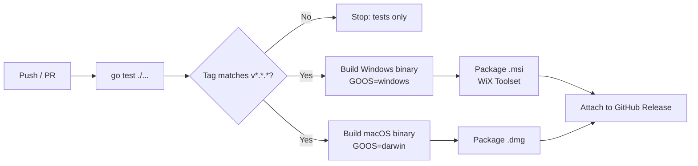

# Build Pipeline — print-bridge

Read `03-architecture/architecture-overview.md` first. This document describes the GitHub Actions setup needed to produce the current beta.

## Starting point

The current repository has:
- Go module with the desktop app entry point, Gin HTTP server, CORS, config, logging, and raw TCP print.
- GitHub Actions CI: automated build/test on push/PR.
- Release workflow triggered by semver tags (`v*.*.*`) that produces Windows and macOS installer artifacts.
- Optional Windows signing hook (`WINDOWS_SIGN_CERT_BASE64` / `WINDOWS_SIGN_CERT_PASSWORD` secrets) — **not used for the current beta** per `01-business/constraints.md`; leave the hook in place but unset, so signing can be turned on later without a workflow rewrite.
- Free macOS ad-hoc signing in the release workflow. This validates the `.app` bundle structure before packaging the DMG, without requiring Apple Developer Program membership.

## What changes for the current beta

| Area | Earlier prototype | Current beta |
|---|---|---|
| Entry point | Headless HTTP server only | Fyne GUI app with embedded HTTP server (single binary, per `03-architecture/architecture-overview.md`) |
| Config | `ALLOW_ORIGINS` env var | `config.json` file (see `06-config/config-schema.md`); Settings UI is the primary path |
| Printer port | Hardcoded `9100` | Configurable per-request via `/print`, with `defaultPrinterPort` in config as a UI convenience (see `04-api/openapi.yaml`) |
| Build output | Raw binary in a zip | Platform installer: `.msi` (Windows), `.dmg` (macOS) — see platform-specific docs below |
| Timeouts | None (unbounded `net.Dial`/`Write`) | Explicit connect/write timeouts per `03-architecture/architecture-overview.md` |
| Logging | None | Rotating local log file |
| Endpoints | `/ping`, `/print` | `/ping`, `/print`, `/status` (new) |

## CI/CD pipeline stages (target)

- Fyne requires CGO and platform-specific build considerations (it links against native GUI libraries) — cross-compiling a Fyne app from a single runner is harder than the prototype's pure-Go cross-compile. **Build Windows and macOS binaries on their native runners** (`windows-latest`, `macos-latest` GitHub-hosted runners) rather than cross-compiling from Linux, to avoid CGO cross-toolchain complexity. This is a change from however the current prototype's multi-platform build is set up (worth checking the existing workflow file directly, since this document is describing the target, not auditing the current YAML line-by-line).
- Packaging (`.msi`/`.dmg`) happens after the binary is built, per platform. See the platform-specific installer docs for tool choices.
- No Windows signing step runs unless the Windows signing secrets are present. The macOS workflow ad-hoc signs and verifies the `.app` bundle before creating the DMG. It does not use paid Developer ID signing or notarization.

## Versioning

Keep the existing semver-tag-triggers-release pattern (`v*.*.*`). No change needed here — it already fits a small solo project well.

## What this document does not cover

- Exact installer tooling/steps — see `installer-windows.md` and `installer-macos.md`.
- What the user sees/does when opening an unsigned installer — also in those two files.
